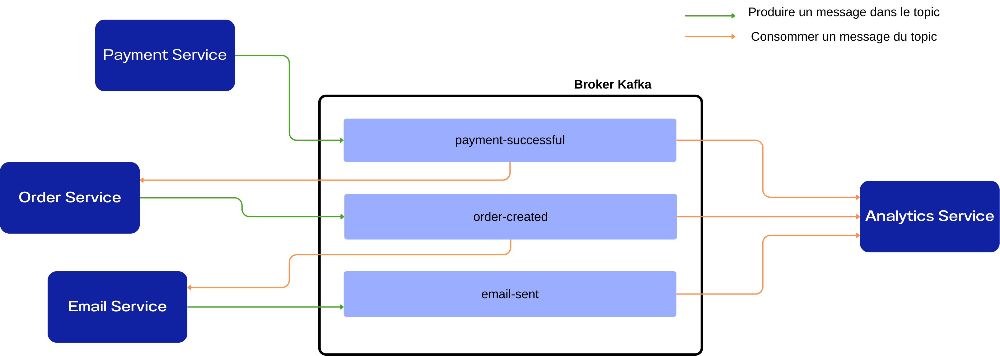

# TP Kafka - Black Friday Challenge

## Contexte

Ce TP simule un petit écosystème e-commerce composé de 4 microservices : `payment-service`, `order-service`, `email-service` et `analytics-service`.
L'objectif est d'implémenter une communication asynchrone entre ces services en utilisant Apache Kafka : les services échangent des événements (paiement réussi, commande créée, e-mail envoyé, etc.) via des topics Kafka.

Le scénario représente un pic d'activité typique du "Black Friday" : forte charge de trafic, besoin de scalabilité (partitions + consumer groups) et de résilience (gestion des messages empoisonnés, DLQ). Ce TP vous guide pour transformer des squelettes de services en une architecture événement-driven capable de tenir une charge importante.


## Objectifs du TP

À la fin de ce TP, vous saurez :

- Créer et configurer des topics Kafka
- Implémenter des producers et consumers
- Configurer les partitions et la réplication
- Utiliser les consumer groups pour la scalabilité
- Gérer les messages empoisonnés (poison pills)

---

## Partie 0 : Installation et Setup

> ###  Checkpoint 0
> **Où en sommes-nous ?** C'est le point de départ ! Vous allez préparer votre environnement de travail.
> 
> **Ce que vous allez faire :**
> - Cloner le projet et installer les dépendances
> - Lancer Kafka avec Docker
> - Découvrir Kafka UI
>

### 0.1 Cloner le projet

```bash
git clone https://github.com/nouhailapiro/SFFS-kafka
cd SFFS-kafka
```

### 0.2 Créer l'environnement virtuel

```bash
# Créer l'environnement
python -m venv venv

# L'activer
source venv/bin/activate  # Linux/Mac
# venv\Scripts\activate   # Windows

# Installer les dépendances
pip install -r requirements.txt
```

### 0.3 Lancer l'infrastructure Kafka

```bash
cd kafka
docker compose up -d
```

Vérifiez que tout fonctionne :
```bash
docker ps
```

Vous devriez voir 2 containers : `kafka` et `kafka-ui`

### 0.4 Accéder à Kafka UI

Ouvrez votre navigateur : **http://localhost:8080**

C'est votre tableau de bord pour visualiser Kafka !

---

## Architecture à réaliser dans ce TP:

Lorsqu’un paiement est validé, le service Payment publie un événement dans le topic payment-successful, consommé par le service Order afin de mettre à jour l’état de la commande. Le service Order publie ensuite un événement dans le topic order-created, qui est consommé par le service Email pour envoyer une notification à l’utilisateur. Une fois l’email envoyé, le service Email publie à son tour un événement dans le topic email-sent. En parallèle, le service Analytics consomme les événements des topics payment-successful, order-created et email-sent afin de collecter des données, produire des statistiques et analyser le comportement global du système. Cette approche favorise un fort découplage entre les services, une meilleure scalabilité et une grande flexibilité pour l’ajout de nouveaux consommateurs.

## Partie 1 : Découverte de Kafka CLI

> ###  Checkpoint 1
> **Où en sommes-nous ?**  L'environnement est prêt, Kafka tourne !
> 
> **Ce que vous allez faire :**
> - Créer vos premiers topics Kafka via CLI
> - Comprendre les concepts de topics, partitions et replication-factor
> - Tester la communication Producer → Consumer avec la console
>

Avant de coder, familiarisons-nous avec les commandes Kafka.


### 1.1 Créer votre premier topic

```bash
docker exec -it kafka kafka-topics --bootstrap-server localhost:9092 \
    --create \
    --topic payment-successful \
    --partitions 1 \
    --replication-factor 1
```

**Vérification:** Allez sur Kafka UI et vérifiez que le topic existe.

### 1.2 Créer les autres topics

Créez les topics suivants avec la même commande :

| Topic | Description |
|-------|-------------|
| `order-created` | Événements de création de commande |
| `email-sent` | Événements d'envoi d'emails


### 1.3 Lister les topics

```bash
docker exec -it kafka kafka-topics --bootstrap-server localhost:9092 --list
```

### 1.4 Tester avec la console

**Terminal 1 - Consumer:**
```bash
docker exec -it kafka kafka-console-consumer \
    --bootstrap-server localhost:9092 \
    --topic payment-successful \
    --from-beginning
```

**Terminal 2 - Producer:**
```bash
docker exec -it kafka kafka-console-producer \
    --bootstrap-server localhost:9092 \
    --topic payment-successful
```

Tapez un message et appuyez sur Entrée. Vous devriez le voir apparaître dans le Terminal 1 !

---

## Partie 2 : Intégration Kafka dans les Services

> ###  Checkpoint 2
> **Où en sommes-nous ?**  Vous maîtrisez les commandes Kafka CLI et avez créé vos topics !
> 
> **Ce que vous allez faire :**
> - Transformer le Payment Service en **Producer** Kafka
> - Transformer l'Order Service en **Consumer** Kafka
> - Créer une chaîne complète d'événements entre les 4 services
> - Tester l'intégration de bout en bout

### 2.1 Le Service de Paiement (Producer)

**Objectif:** Modifier `payment-service/payment.py` pour envoyer un message Kafka lorsqu'un paiement est effectué.


**Guidé (pas à pas) :**

1. Importer le `Producer` depuis `confluent_kafka`

```python
# À ajouter en tête de `payment-service/payment.py`
from confluent_kafka import Producer
```

on importe `Producer` pour envoyer des messages

1. Créer la configuration et l'instance du producer

```python
# Config et instance (réutiliser la même instance pour l'application)
producer_config = {"bootstrap.servers": "localhost:9094"}
producer = Producer(producer_config)
```

`bootstrap.servers` pointe vers le broker Kafka.

2. Ajouter une fonction de callback `delivery_report` pour logger le résultat

```python
def delivery_report(err, msg):
    if err:
        print(f"Kafka delivery failed: {err}")
    else:
        print(f"Message envoyé → topic:{msg.topic()}")
```

Le callback permet de confirmer l'envoi asynchrone et d'afficher la partition/offset pour debug.

3. Produire le message `payment-successful` après traitement

```python
event = {"user_id": user_id, "cart": cart, "timestamp": time.time()}

producer.produce(
    topic="payment-successful",
    value=json.dumps(event).encode("utf-8"),
    callback=delivery_report
)
producer.flush()  # attendre que le message soit envoyé
```

L'API `produce` attend des bytes pour la `value` — d'où `json.dumps(...).encode('utf-8')`. Utiliser `flush()` permet de s'assurer que le message a bien été émis avant de terminer la requête.


**Lancez le service :**
```bash
python payment-service/payment.py
```

**Dans un autre terminal, testez avec curl :**
```bash
curl -X POST http://localhost:8000/payment \
    -H "Content-Type: application/json" \
    -d '{"user_id": 1, "cart": [{"name": "iPhone", "price": 999, "quantity": 1}]}'
```

**Vérification:** Regardez le topic `payment-successful` dans Kafka UI. Vous devriez voir votre message !

### 2.2 Le Service de Commande ( Consumer / Producer )

**Objectif:** Création d'un consommateur dans `order-service/order.py` qui lit les événements publiés sur le topic `payment-successful` et les transforme en commandes en mémoire.


1) Importer les modules nécessaires:

```python
# En tête du fichier
import json
import threading
from confluent_kafka import Consumer
```
Explication : on importe `Consumer` pour se connecter à Kafka, `json` pour décoder les messages, et `threading` pour faire tourner le consumer en arrière-plan.

2) Créer la configuration et l'instance du consumer

```python
# Configuration du consumer
consumer_config = {
    "bootstrap.servers": "localhost:9094",
    "group.id": "order-service-group",
    "auto.offset.reset": "earliest"
}

consumer = Consumer(consumer_config)
```

Explication : `group.id` permet le scalabilité via consumer groups (On verra ça en détails un peu plus tard). `auto.offset.reset: earliest` garantit que le consumer lit depuis le début si aucun offset n'existe.


3) Implémenter la boucle du consumer (lecture et décodage)

```python
def kafka_consumer_loop():
    consumer.subscribe(["payment-successful"])
    print("Consumer démarré, en écoute sur 'payment-successful'...")

    try:
        while True:
            msg = consumer.poll(1.0)

            if msg is None:
                continue
            if msg.error():
                print(f"Erreur consumer: {msg.error()}")
                continue

            try:
                # Décoder la charge utile (value) en JSON
                payload = json.loads(msg.value().decode('utf-8'))
                process_payment_event(payload)
            except Exception as e:
                print(f"Erreur de traitement: {e}")
    finally:
        consumer.close()
```

```python
if __name__ == '__main__':
        # Lancer le consumer dans un thread séparé
        consumer_thread = threading.Thread(target=kafka_consumer_loop, daemon=True)
        consumer_thread.start()
        
        print("Service de commande démarré sur le port 8001")
        app.run(host='0.0.0.0', port=8001, debug=False)
```

Explication : la boucle utilise `consumer.poll()` pour récupérer les messages. On décode `msg.value()` en UTF-8 puis en JSON, et on appelle la fonction de traitement. Les exceptions sont attrapées pour éviter que le consumer plante sur un message invalide.

5) A vous de jouer ! Émettre l'événement `order-created` depuis `order-service`

Indication : réutilisez la technique montrée en 2.1 pour créer un `Producer` et envoyer l'objet `order` au topic `order-created`. Étapes conseillées :

- Importer `Producer` depuis `confluent_kafka`.
- Instancier `Producer` avec `bootstrap.servers` pointant sur `localhost:9094`.
- Après création de l'objet `order` dans `process_payment_event`, envoyer l'événement via `producer.produce(...)`.
- Pour l'envoi, encodez la valeur en bytes (voir 2.1) et utilisez une callback `delivery_report` pour logger le résultat.

**Lancez le service :**
```bash
python order-service/order.py
```
Remarquez que une fois le service lancé: On consomme les messages qui étaient produits dans le topic 'payment-successful'
### 2.3 Le Service Email (Consumer / Producer)

**Objectif:** Modifier `email-service/email-service.py` pour consommer les messages du topic `order-created` et produire des messages sur le topic `email-sent`.

**TODO:**

1. Importer Consumer et Producer Kafka
2. Créer la configuration du consumer pour le topic `order-created`
3. Produire un message sur le topic `email-sent` après envoi
4. Implémenter la boucle de consommation

Inspirez vous des cas précédents !

**Lancez le service :**
```bash
python email-service/email-service.py
```

**Vérification:** Allez sur Kafka UI et vérifiez :
1. Le service écoute le topic `order-created`
2. Il produit des messages sur le topic `email-sent`


**Testez avec curl :**
```bash
# Vérifier les emails envoyés
curl http://localhost:8002/emails
```

### 2.4 Le Service Analytics (Multi-Consumer)

**Objectif:** Modifier `analytics-service/analytics.py` pour consommer les messages provenant de PLUSIEURS topics (`payment-successful`, `order-created`, `email-sent`) et maintenir des statistiques en temps réel.

**TODO:**

1. Importer Consumer Kafka
2. Créer la configuration du consumer
3. S'abonner aux 3 topics payment-successful, order-created, email-sent


**Lancez le service :**
```bash
python analytics-service/analytics.py
```


### 2.5 Test de l'intégration

Lancez tous les services dans des terminaux séparés :

```bash
# Terminal 1
python payment-service/payment.py

# Terminal 2
python order-service/order.py

# Terminal 3
python email-service/email-service.py

# Terminal 4
python analytics-service/analytics.py
```

Envoyez un paiement :
```bash
curl -X POST http://localhost:8000/payment \
    -H "Content-Type: application/json" \
    -d '{"user_id": 42, "cart": [{"name": "MacBook", "price": 1999, "quantity": 1}]}'
```

**Vérification:** Vous devriez voir :
1. Le paiement traité (Terminal 1)
2. La commande créée (Terminal 2)
3. L'email envoyé (Terminal 3)
4. Les statistiques de chaque service qui s'affichent (Terminal 4)

---

## Partie 3 : Simulation Black Friday - Observer le problème

> ###  Checkpoint 3
> **Où en sommes-nous ?**  Tous vos services communiquent via Kafka ! 
> 
> **Le problème :** Votre système fonctionne... mais tiendra-t-il le Black Friday ?
>
> **Ce que vous allez faire :**
> - Comprendre le concept de **LAG** (retard de traitement)
> - Simuler un pic de charge avec 1000+ messages
> - Observer votre unique consumer se noyer sous la charge
> - Identifier le goulet d'étranglement
>
> **Spoiler :** Ça va mal se passer !  Et c'est le but.
>

Le but de cette partie est de **voir le problème** : avec une seule partition et un seul consumer, le système ne peut pas absorber un pic de charge.

### 3.1 Comprendre le lag

Le **lag** est la différence entre :
- Le nombre de messages produits dans Kafka
- Le nombre de messages consommés par votre consumer

```
Messages produits:    [============================] 5000
Messages consommés:   [========]                     1200
                      ↑
                      lag = 3800 messages en retard!
```

Un lag élevé signifie que votre consumer n'arrive pas à suivre le rythme de production.

### 3.2 Ajouter un délai de traitement au consumer

Pour simuler un traitement réaliste (accès base de données, appels API, etc.), modifiez votre `order-service/order.py` pour ajouter un délai dans `process_payment_event`:

```python
import time

def process_payment_event(message):
    user_id = message.get('user_id')
    cart = message.get('cart')
    
    # Simulation d'un traitement lent (accès DB, validation, etc.)
    time.sleep(0.1)  # 100ms par message = max 10 messages/seconde
    
    order = {
        'order_id': len(orders) + 1,
        'user_id': user_id,
        'items': cart,
        'status': 'confirmed'
    }
    # ... reste du code
```

### 3.3 Lancer la simulation Black Friday

**Terminal 1 - Lancez votre order-service:**
```bash
python order-service/order.py
```

**Terminal 2 - Injectez 1000 messages dans Kafka:**
```bash
python scripts/kafka_flood.py -n 1000
```

Vous verrez que les 1000 messages sont envoyés en quelques secondes.

### 3.4 Observer le lag dans Kafka UI

**Ouvrez Kafka UI :** http://localhost:8080

1. Cliquez sur **"Consumers"** dans le menu de gauche
2. Cliquez sur **"order-service-group"**
3. Observez la colonne **"Lag"** pour le topic `payment-successful`


**Le consumer traite ~10 messages/seconde, mais on en a injecté 1000 en quelques secondes !**

Rafraîchissez la page régulièrement pour voir le lag diminuer lentement.

**Problème identifié:** Avec une seule partition et un seul consumer, le système ne tient pas la charge ! Votre unique consumer met plusieurs minutes à rattraper son retard.

---

## Partie 4 : Optimisation avec les Partitions et Consumer Groups

> ###  Checkpoint 4
> **Où en sommes-nous ?**  Vous avez identifié le problème : 1 partition + 1 consumer = BOTTLENECK !
> 
> **La solution :** Paralléliser le traitement avec les **partitions** et **consumer groups** !
>
> **Ce que vous allez faire :**
> - Recréer les topics avec **3 partitions**
> - Lancer **3 instances** de votre consumer (consumer group)
> - Observer Kafka distribuer automatiquement les partitions
> - Constater que le lag descend 3x plus vite !
>
> **Objectif :** Passer de 10 msg/s à 30 msg/s de traitement
>

### 4.1 Comprendre les partitions

Les partitions permettent de paralléliser le traitement des messages. **Chaque partition ne peut être lue que par UN seul consumer du même groupe.**

```
                    Topic: payment-successful (3 partitions)
        ┌─────────────────┬─────────────────┬─────────────────┐
        │   Partition 0   │   Partition 1   │   Partition 2   │
        │   (messages     │   (messages     │   (messages     │
        │    1, 4, 7...)  │    2, 5, 8...)  │    3, 6, 9...)  │
        └────────┬────────┴────────┬────────┴────────┬────────┘
                 │                 │                 │
                 ▼                 ▼                 ▼
            Consumer 1        Consumer 2        Consumer 3
            (10 msg/s)        (10 msg/s)        (10 msg/s)
                              
                    = 30 messages/seconde au total!
```

**Règle importante:** Nombre de consumers ≤ Nombre de partitions

### 4.2 Arrêter les services et recréer les topics avec 3 partitions

```bash
# Arrêtez tous vos services (Ctrl+C)

# Supprimer les anciens topics (payment-successful et order-created)
docker exec -it kafka kafka-topics --bootstrap-server localhost:9092 \
    --delete --topic payment-successful 

docker exec -it kafka kafka-topics --bootstrap-server localhost:9092 \
    --delete --topic order-created 

# réecrer avec 3 partitions (s'inspirer des commandes 1.1)
```

### 4.3 Observer la distribution des messages (côté Producer)

Modifiez la fonction `delivery_report` dans votre **payment-service** pour afficher la partition et l'offset :

```python
def delivery_report(err, msg):
    if err:
        print(f" Kafka delivery failed: {err}")
    else:
        print(f" Message envoyé → Topic: {msg.topic()} | Partition: {msg.partition()} | Offset: {msg.offset()}")
```

Relancez le service et envoyez **5-10 paiements** avec des `user_id` différents :

```bash
curl -X POST http://localhost:8000/payment \
    -H "Content-Type: application/json" \
    -d '{"user_id": 1, "cart": [{"name": "iPhone", "price": 999, "quantity": 1}]}'

curl -X POST http://localhost:8000/payment \
    -H "Content-Type: application/json" \
    -d '{"user_id": 2, "cart": [{"name": "MacBook", "price": 1999, "quantity": 1}]}'

# ... continuez avec user_id 3, 4, 5...

```

**Observez les logs :**
```
 Message envoyé → Topic: payment-successful | Partition: 1 | Offset: 0
 Message envoyé → Topic: payment-successful | Partition: 0 | Offset: 0
 Message envoyé → Topic: payment-successful | Partition: 2 | Offset: 0
 Message envoyé → Topic: payment-successful | Partition: 1 | Offset: 1
...
```

 Les messages sont répartis entre les 3 partitions (round-robin sans clé).

### 4.4 Observer l'assignation des partitions (côté Consumer)

Modifiez votre **order-service** pour afficher quelle partition est lue et ajouter un identifiant d'instance :
ceci sert à identifier les consumers par la suite
```python
import os

# Identifiant unique pour cette instance (via variable d'environnement)
INSTANCE_ID = os.environ.get('INSTANCE_ID', '1')
PORT = int(os.environ.get('PORT', 8001))

def kafka_consumer_loop():
    consumer.subscribe(["payment-successful"])
    print(f" Consumer Instance #{INSTANCE_ID} démarré, en écoute sur 'payment-successful'...")
    
    while True:
        msg = consumer.poll(1.0)
        
        if msg is None:
            continue
        if msg.error():
            print(f" Erreur: {msg.error()}")
            continue
            
        try:
            data = json.loads(msg.value().decode('utf-8'))
            #  AFFICHER L'INSTANCE ET LA PARTITION
            print(f" [Instance #{INSTANCE_ID}] [Partition {msg.partition()}] [Offset {msg.offset()}] User {data.get('user_id')}")
            process_payment_event(data)
        except Exception as e:
            print(f" Erreur de traitement: {e}")

# À la fin du fichier, modifiez le main :
if __name__ == '__main__':
    consumer_thread = threading.Thread(target=kafka_consumer_loop, daemon=True)
    consumer_thread.start()
#    modification ici
    print(f" Service de commande Instance #{INSTANCE_ID} démarré sur le port {PORT}")
    app.run(host='0.0.0.0', port=PORT, debug=False)
```

### 4.5 Lancer 3 instances du service (Consumer Group)

**Lancez 3 instances dans 3 terminaux différents :**

```bash
# Terminal 1
INSTANCE_ID=1 PORT=8001 python order-service/order.py

# Terminal 2
INSTANCE_ID=2 PORT=8002 python order-service/order.py

# Terminal 3
INSTANCE_ID=3 PORT=8003 python order-service/order.py
```

>  Les 3 instances partagent le même `group.id` ("order-service-group"), donc Kafka va automatiquement distribuer les partitions entre elles !

### 4.6 Observer la magie du Consumer Group !

Envoyez maintenant 10 paiements rapidement :

```bash
for i in {1..10}; do
  curl -s -X POST http://localhost:8000/payment \
    -H "Content-Type: application/json" \
    -d "{\"user_id\": $i, \"cart\": [{\"name\": \"Product$i\", \"price\": 100, \"quantity\": 1}]}"
done
```

**Observez les 3 terminaux :**

```
Terminal 1 (Instance #1) :
 [Instance #1] [Partition 0] [Offset 0] User 2
 [Instance #1] [Partition 0] [Offset 1] User 5
 [Instance #1] [Partition 0] [Offset 2] User 8

Terminal 2 (Instance #2) :
 [Instance #2] [Partition 1] [Offset 0] User 1
 [Instance #2] [Partition 1] [Offset 1] User 4
 [Instance #2] [Partition 1] [Offset 2] User 7

Terminal 3 (Instance #3) :
 [Instance #3] [Partition 2] [Offset 0] User 3
 [Instance #3] [Partition 2] [Offset 1] User 6
 [Instance #3] [Partition 2] [Offset 2] User 9
```

 **Chaque instance ne traite QUE les messages de SA partition !**

### 4.7 Relancer la simulation Black Friday

Avec vos 3 consumers actifs, relancez le flood :

```bash
python scripts/kafka_flood.py -n 1000
```

**Surveillez le lag dans Kafka UI :**
1. Allez sur http://localhost:8080
2. Cliquez sur **"Consumers"** → **"order-service-group"**
3. Observez le lag diminuer beaucoup plus rapidement qu'avant !

| Configuration | Débit de traitement | Temps pour 1000 messages |
|--------------|---------------------|--------------------------|
| 1 partition, 1 consumer | ~10 msg/s | ~100 secondes |
| 3 partitions, 3 consumers | ~30 msg/s | ~33 secondes |

**Le lag descend 3x plus vite !**

### 4.9 Expérience : Que se passe-t-il si un consumer tombe ?

1. **Arrêtez l'Instance #2** (Ctrl+C dans le Terminal 2)
2. Attendez quelques secondes (rebalancing)
3. Envoyez de nouveaux messages

**Résultat :** Les instances #1 et #3 se répartissent maintenant les 3 partitions !

```
Terminal 1 (Instance #1) :
 [Instance #1] [Partition 0] [Offset 3] User 11
 [Instance #1] [Partition 1] [Offset 3] User 12  ← Récupère la Partition 1 !

Terminal 3 (Instance #3) :
 [Instance #3] [Partition 2] [Offset 3] User 13
```

### 4.10 Questions de réflexion

1. **Que se passe-t-il si on a 3 partitions et 5 consumers ?**
   > <details> <summary>Réponse</summary> Seulement 3 consumers seront actifs (1 par partition). Les 2 autres seront en "standby". </details>

2. **Que se passe-t-il si on a 3 partitions et 1 seul consumer ?**
   > <details> <summary>Réponse</summary> Le consumer unique consomme toutes les partitions. Aucun parallélisme. </details>

3. **Quel est le nombre optimal de consumers ?**
   > <details> <summary>Réponse</summary> Idéalement 1 consumer par partition pour maximiser le parallélisme. </details>
---

## Partie 5 : Gestion des Messages Empoisonnés (Bonus)

> ###  Checkpoint 5
> **Où en sommes-nous ?**  Votre système scale horizontalement ! Vous êtes prêts pour le Black Friday... ou presque.
> 
> **Nouveau problème :** Que se passe-t-il si un message est corrompu ou malformé ?
>
> **Ce que vous allez faire :**
> - Découvrir les "poison pills" (messages empoisonnés)
> - Observer un consumer crasher sur un message invalide
> - Implémenter une **Dead Letter Queue (DLQ)** pour isoler les erreurs
> - Rendre votre système résilient aux données corrompues
>

### 5.1 Qu'est-ce qu'un message empoisonné ?

Un "poison pill" est un message malformé qui peut faire crasher votre consumer :
- JSON invalide
- Champs manquants
- Types incorrects
- Valeurs nulles

### 5.2 Tester les messages empoisonnés

```bash
python scripts/poison_pill_test.py
```

Observez les logs de vos consumers. Que se passe-t-il ?

### 5.3 Implémenter une gestion robuste

**Objectif:** Modifier le consumer pour :

0. Créer un topic 'dlq-payment'
1. Attraper les erreurs de parsing
2. Logger les erreurs
3. Envoyer les messages en erreur dans une Dead Letter Queue (DLQ)
4. Continuer le traitement des autres messages

<details>
<summary>Solution avec DLQ</summary>

```python
def send_to_dlq(message, error_reason):
    """Envoie un message dans la Dead Letter Queue"""
    dlq_message = {
        "original_message": message.decode('utf-8') if isinstance(message, bytes) else str(message),
        "error": error_reason,
        "timestamp": time.time()
    }

    producer.produce(
        topic="dlq-payment",
        value=json.dumps(dlq_message).encode('utf-8'),
        callback=delivery_report
    )
    producer.poll(0)
    print(f"Message envoyé à la DLQ: {error_reason}")

def kafka_consumer_loop():
    consumer.subscribe(["payment-successful"])
    print("Consumer démarré, en écoute sur 'payment-successful'...")

    while True:
        msg = consumer.poll(1.0)

        if msg is None:
            continue
        if msg.error():
            print(f"Erreur: {msg.error()}")
            continue

        raw_value = msg.value()

        try:
            # 1. Parsing JSON
            data = json.loads(raw_value.decode('utf-8'))

            # 2. Validation des champs requis
            if not isinstance(data.get('user_id'), (int, str)):
                raise ValueError("user_id invalide")
            if not isinstance(data.get('cart'), list):
                raise ValueError("cart doit être une liste")
            if not all(isinstance(item.get('name'), str) for item in data.get('cart', [])):
                raise ValueError("Le nom de chaque item doit être une chaîne de caractères")
            if not all(isinstance(item.get('price'), (int, float)) and item.get('price') > 0 for item in data.get('cart', [])):
                raise ValueError("Le prix de chaque item doit être un nombre positif")
            """if not all(isinstance(item.get('quantity'), int) and item.get('quantity') > 0 for item in data.get('cart', [])):
                raise ValueError("La quantité de chaque item doit être un entier positif")"""
            if any(len(item.get('name', '')) > 100 for item in data.get('cart', [])):
                raise ValueError("Le nom de l'item est trop long")
            if contains_special_chars(str(data.get('user_id'))):
                raise ValueError("Caractères spéciaux détectés dans user_id")
            for item in data.get('cart', []):
                if contains_special_chars(str(item.get('name', ''))):
                    raise ValueError("Caractères spéciaux détectés dans le nom de l'item")
            # 3. Traitement
            process_payment_event(data)

        except json.JSONDecodeError as e:
            print(f"JSON invalide: {e}")
            send_to_dlq(raw_value, str(e))

        except ValueError as e:
            print(f"Validation échouée: {e}")
            send_to_dlq(raw_value, str(e))

        except Exception as e:
            print(f"Erreur inattendue: {e}")
            send_to_dlq(raw_value, str(e))

def contains_special_chars(text):
    # Exemple de détection de caractères potentiellement malveillants
    return bool(re.search(r"[<>'\"%;()&+]", text))
```
</details>

### 5.4 Vérifier la DLQ

Après avoir relancé le test des poison pills :

```bash
docker exec -it kafka kafka-console-consumer \
    --bootstrap-server localhost:9092 \
    --topic dlq-payment \
    --from-beginning
```

---

## Partie 6 : Défis Bonus++

> ###  Checkpoint Final
> **Félicitations !**  Vous avez construit un système e-commerce capable de survivre au Black Friday !
> 
> **Ce que vous avez appris :**
> -  Créer et gérer des topics Kafka
> -  Implémenter des Producers et Consumers
> -  Identifier les problèmes de scalabilité (LAG)
> -  Paralléliser avec les partitions et consumer groups
> -  Gérer les erreurs avec une Dead Letter Queue
>
> **Pour aller plus loin :** Ces défis bonus explorent des concepts avancés de Kafka en production.

### Défi 1 : Réplication pour la haute disponibilité

Modifiez le `docker-compose.yml` pour avoir un cluster de 3 brokers Kafka et configurez la réplication factor à 3.

### Défi 2 : Monitoring avec Prometheus et Grafana

Intégrez des outils de monitoring pour suivre les métriques Kafka en temps réel.

### Défi 3 : Exactly-once semantics

Configurez les transactions Kafka pour garantir qu'un message n'est traité qu'une seule fois.

---

## Ressources

- [Documentation Apache Kafka](https://kafka.apache.org/documentation/)
- [Confluent Kafka Python](https://docs.confluent.io/platform/current/clients/confluent-kafka-python/)
- [Kafka UI](https://github.com/provectus/kafka-ui)

---

## Nettoyage

```bash
# Arrêter les containers
cd kafka
docker compose down

# Supprimer les volumes (optionnel - supprime toutes les données)
docker compose down -v

# Désactiver l'environnement virtuel
deactivate
```


---
